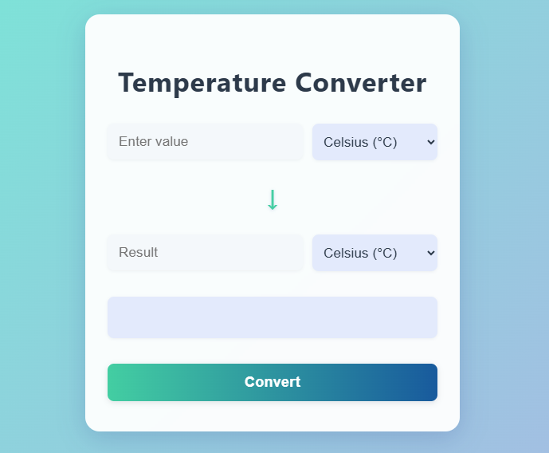

<p align="center">
  <a href="https://rajnikant357.github.io/temperature-converter/" target="_blank" style="display:inline-block;padding:18px 36px;font-size:1.3rem;font-weight:bold;background:linear-gradient(90deg,#43cea2 0%,#185a9d 100%);color:#fff;border-radius:12px;text-decoration:none;box-shadow:0 2px 8px rgba(44,62,80,0.13);margin:18px 0;">
    🚀 Live Demo: Try the Temperature Converter!
  </a>
</p>

# Temperature Converter Web App

A simple and modern web application to convert temperatures between Celsius, Fahrenheit, and Kelvin. Instantly see the result and the formula used for the conversion.

## Features
- Convert between Celsius (°C), Fahrenheit (°F), and Kelvin (K)
- Clean, responsive, and visually appealing UI
- Shows the formula used for each conversion
- Easy to use: just enter a value, select units, and click Convert

## Demo
 <!-- Add a screenshot if available -->

## How to Use
1. Clone or download this repository.
2. Open `index.html` in your web browser.
3. Enter the temperature value you want to convert.
4. Select the input and output units.
5. Click the **Convert** button to see the result and the formula.

## Project Structure
```
├── index.html      # Main HTML file
├── style.css       # App styling
├── script.js       # Conversion logic and interactivity
└── README.md       # Project info (this file)
```

## License
This project is open source and free to use.
